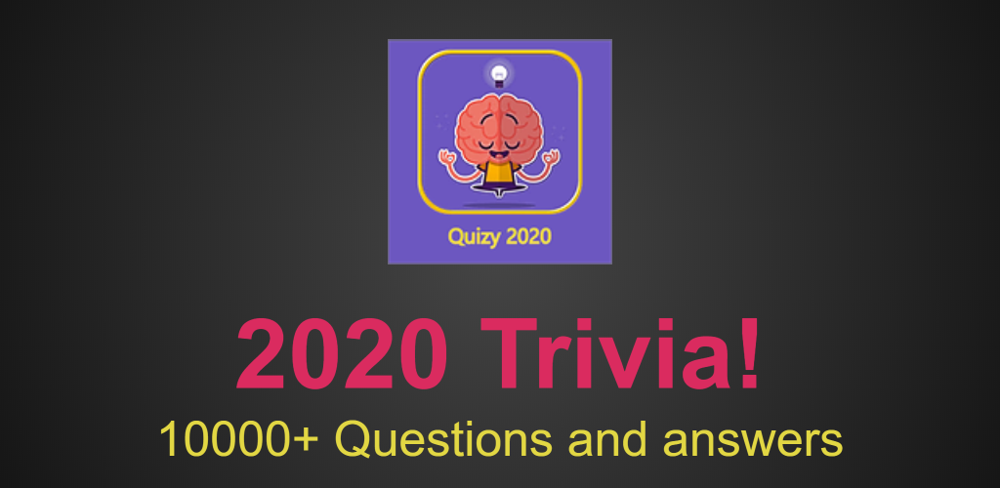
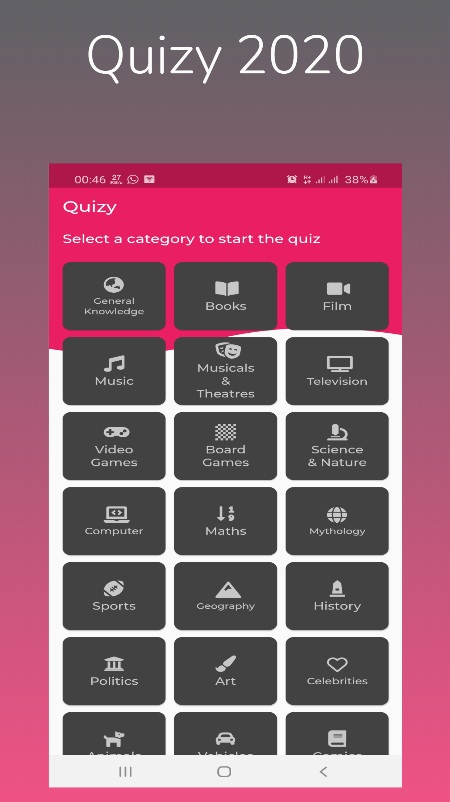
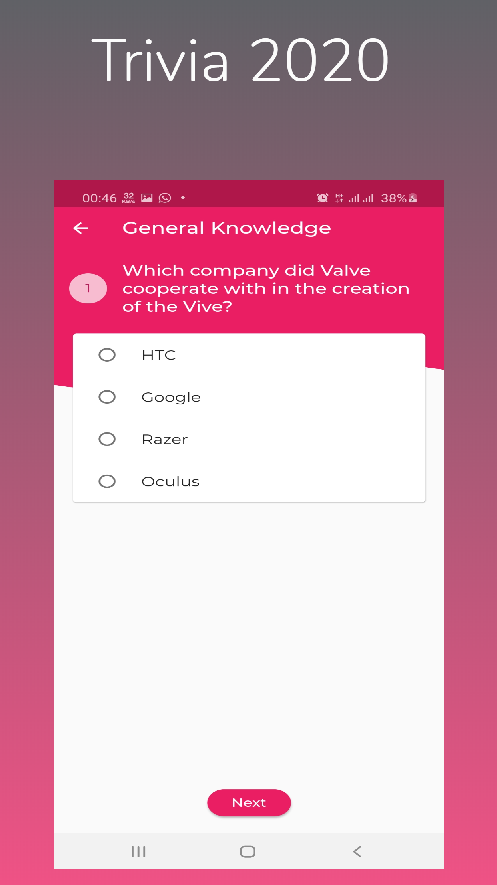
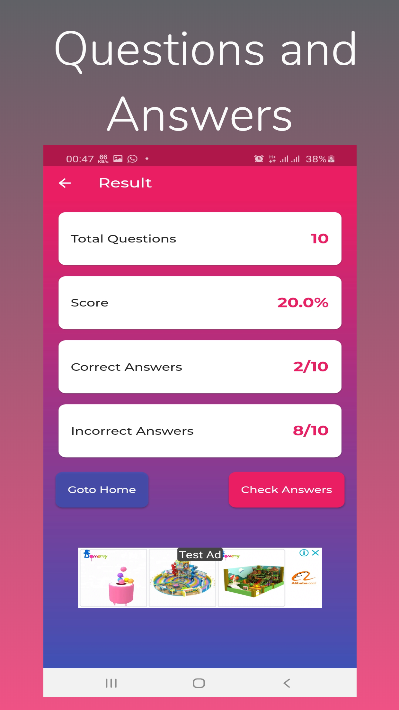
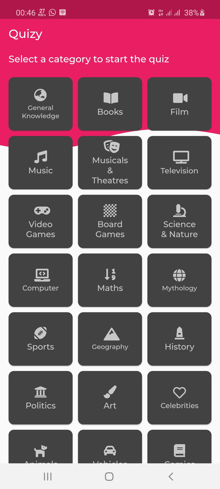

# OpenTrivia
A quiz app in flutter

## Libraries used
- [Font Awesome Flutter](https://pub.dev/packages/font_awesome_flutter)
- [Flutter Custom Clippers](https://pub.dev/packages/flutter_custom_clippers)
- [Html Unescape](https://pub.dev/packages/html_unescape)
- [Auto Size Text](https://pub.dev/packages/auto_size_text)

## Screenshots

 

